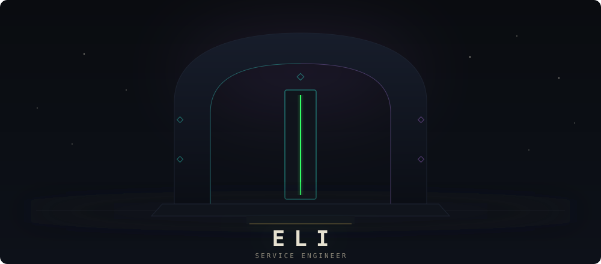
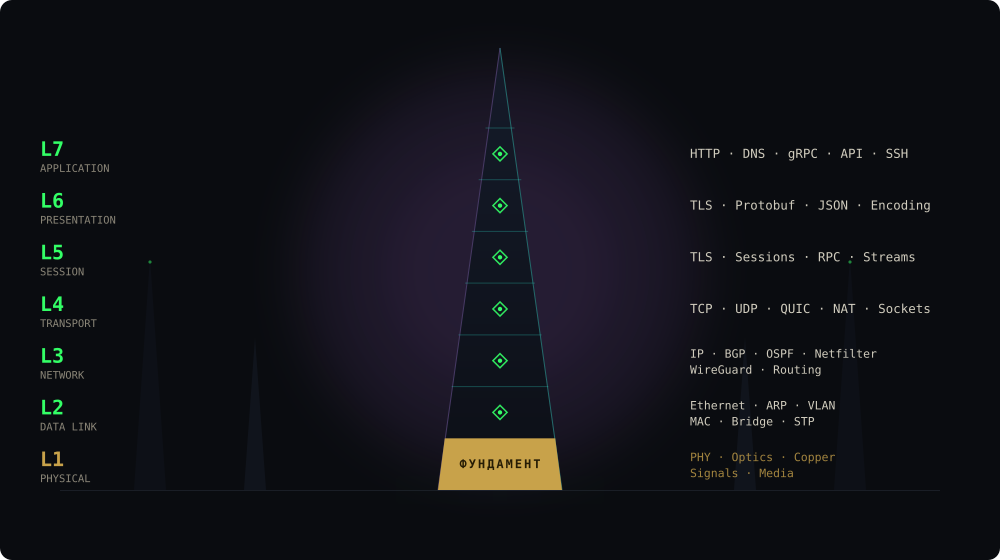
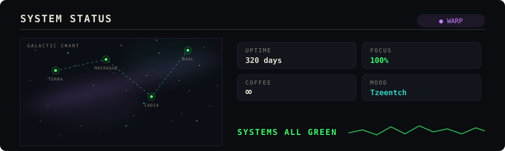

<!-- obelisk.svg и system-status.svg генерируются скриптами из config/ и scripts/
     экшен перегенерирует их раз в сутки (счётчик аптайма живёт сам) -->

<div align="center">



</div>

## whoami

```
$ creed
я завёл гробницы некронов.
я видел legacy хаоса.
я патчил золотой трон императора. 
```

<div align="center">

</div>

## osi obelisk

семь уровней вечного зала.

<div align="center">

</div>

## tech arsenal

- `bash` — литания короче, чем моё терпение
- `go` — компилируется быстрее, чем я успеваю передумать
- `rust` — трибунал строже, чем borrow checker, только у инквизиции

## machine spirits

ускоряют ритуал, как учил омниссия. 

- **zcode**: охота на тиранидов
- **GLM**: разум титана.
- **goose**: готовые ритуалы
- **deepseek**: плавает в варпе без геллер-поля


<div align="center">

</div>

## litany of connection

> дойди до сокета, исполни обет:
> рестарт не смерть, если остался след.
> варп молчит, пока держит канал,
> связь это истина, а истина - храм.

## system status

<div align="center">

</div>

<div align="center">

</div>

<div align="center">
<sub>СВЯЗЬ ОБОРВАНА.</sub>
</div>
